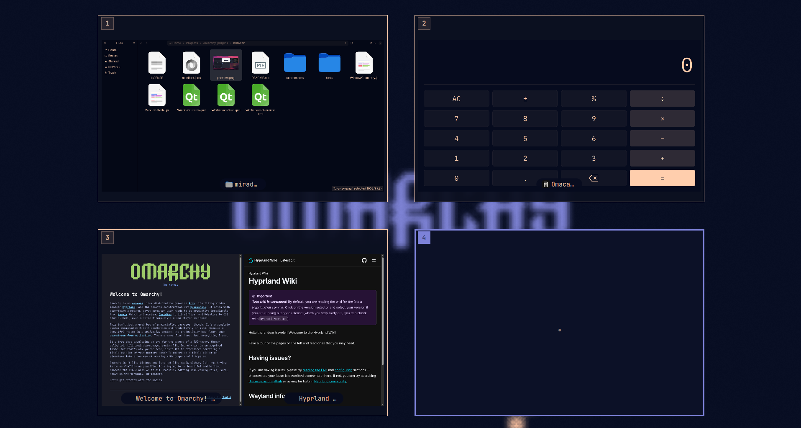

# Mirador

An external Omarchy Shell plugin that presents a fullscreen overview of
workspaces and their windows. It supports keyboard navigation, window
activation, and dragging windows between workspaces.


## Demo


https://github.com/user-attachments/assets/9b103f22-26b8-4e23-a17b-73527a0806c3


## Install

Install through Omarchy:

```bash
omarchy plugin add https://github.com/sanjyay/Mirador.git
```

Alternatively, install it manually by cloning this repository into your
Omarchy plugins directory:

```bash
mkdir -p ~/.config/omarchy/plugins
git clone https://github.com/sanjyay/Mirador.git \
  ~/.config/omarchy/plugins/mirador
omarchy-shell shell rescanPlugins
```

## Launching the overview

The overview can be opened with `Shift+Tab` or a three-finger swipe up on the
touchpad. A three-finger swipe down closes it.

Add the keyboard binding to `~/.config/hypr/bindings.lua`:

```lua
o.bind(
  "SHIFT + TAB",
  "Workspace overview",
  "omarchy-shell shell toggle mirador '{}'"
)
```

Add the touchpad gestures to `~/.config/hypr/input.lua`:

```lua
hl.gesture({
  fingers = 3,
  direction = "up",
  action = function()
    hl.dispatch(hl.dsp.exec_cmd("omarchy-shell shell summon mirador '{}'"))
  end,
})

hl.gesture({
  fingers = 3,
  direction = "down",
  action = function()
    hl.dispatch(hl.dsp.exec_cmd("omarchy-shell shell hide mirador"))
  end,
})
```

Hyprland reloads these files automatically. You can also apply and validate the
configuration manually:

```bash
hyprctl reload
hyprctl configerrors
```

### Changing the keyboard binding

Edit the key combination in the first argument of `o.bind` in
`~/.config/hypr/bindings.lua`. For example, to use `Super+Tab` instead:

```lua
o.bind(
  "SUPER + TAB",
  "Workspace overview",
  "omarchy-shell shell toggle mirador '{}'"
)
```

If the replacement shortcut already has an Omarchy binding, unbind it first.
`Super+Tab`, for example, normally switches to the next workspace:

```lua
hl.unbind("SUPER + TAB")
o.bind(
  "SUPER + TAB",
  "Workspace overview",
  "omarchy-shell shell toggle mirador '{}'"
)
```

To inspect existing shortcuts before choosing one, run:

```bash
omarchy menu keybindings --print
```

You can also open the overview directly from a terminal with:

```bash
omarchy-shell shell summon mirador '{}'
```

The plugin depends only on APIs and shared UI components provided by the
Omarchy Shell. It does not require `hyprexpo`, `hyprpm`, or client polling.

## License

Mirador is available under the [MIT License](LICENSE).
