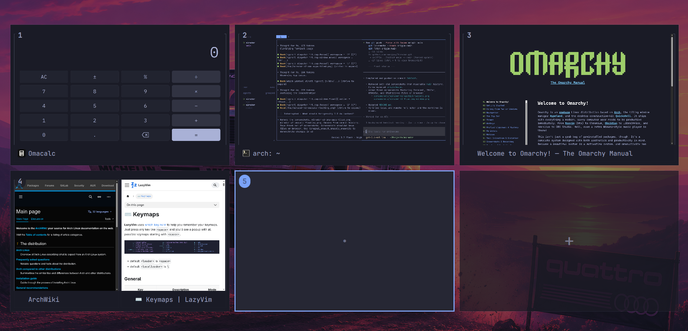
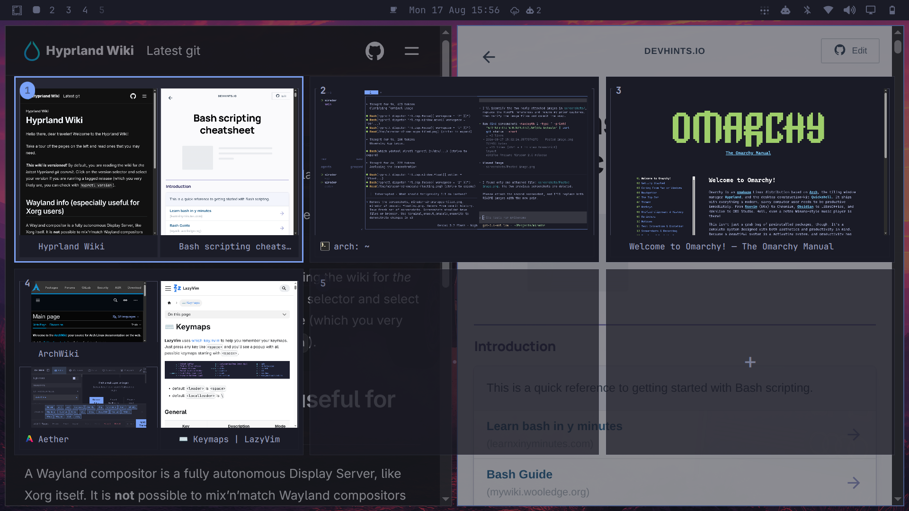

# Mirador

An external Omarchy Shell plugin that presents a fullscreen overview of
workspaces and their windows. It supports keyboard navigation, window
activation, spatial previews that reflect each window's compositor geometry,
and dragging windows between workspaces.


https://github.com/user-attachments/assets/3bfd7c50-175f-442e-aae8-73df010d05e7


## What's new in version 2.1.1

* **Cyclic & Wrap-Around Keyboard Navigation**: Smooth continuous navigation across workspaces using arrow keys or Vim bindings (`h`, `j`, `k`, `l`):
  * **Horizontal Continuous Global Cycling (`Left`/`h`, `Right`/`l`)**: Navigates cards in visual reading order across all rows without getting trapped at row boundaries, wrapping seamlessly from the last workspace back to the first, and vice versa.
  * **Vertical Spatial Row Navigation & Wrapping (`Up`/`k`, `Down`/`j`)**: Moves directly between visual rows, jumping to the card in the target row whose horizontal center is geometrically closest to the current card. Moving Up from the top row wraps around to the bottom row, and moving Down from the bottom row wraps to the top row.
* **Focused Workspace Dimming Contrast**: Inactive workspaces are subtly dimmed (0.90 opacity) while the active workspace stays fully opaque (1.0) with an accent border, keeping all window previews clear and readable while instantly identifying which workspace is currently active.

## What's new in version 2.1

* **First-Class Drag-to-Create Insertion Cards**: Temporary workspace insertion targets now render as full-sized workspace cards (`InsertionWorkspaceCard`) with matching KDE badges, centered `+` icons, and `"Drop to create WS N"` cues. The overview grid dynamically reflows during drag to give insertion targets proper card presence.
* **Seamless Single-Pull Drag & Drop**: Persistent delegate architecture ensures that window previews and drag sessions remain uninterrupted when the layout expands, allowing windows to be moved to existing or new workspaces on the very first pull.
* **KDE-Style Workspace Number Badges**: Streamlined card headers with clean, prominent number badges (`[1]`, `[2]`, ... `[0]`) in the top-left corner, removing visual clutter and maximizing window preview area.
* **Fast Keyboard Navigation & Activation**: Move card selection smoothly using arrow keys or Vim bindings (`h`, `j`, `k`, `l`) and press `Enter`/`Return` to immediately jump to that workspace and dismiss the overview. Press `+` or `=` to create the next contextual workspace.
* **Crisp, Content-Independent Card Borders**: Dedicated topmost border overlay (`z: 100`) with integer pixel-aligned layout ensures complete, uniform 4-sided borders around all inactive workspaces regardless of dark terminal backgrounds or child preview contents.

## What's new in version 2

<details>
<summary><b>Version 2 — click to reveal all changes</b></summary>

### 🚀 Key Changes in Version 2.0

* **Spatial Window Previews**: Window previews now preserve their approximate compositor position, size, and stacking order inside each workspace card. Tiled layouts remain recognizable at a glance, and floating windows overlap tiled windows naturally.
* **Conditional Live Window Previews**: Active window previews stream in real time while Mirador is open so typing in terminals, playing videos, and web scrolling update immediately. Live capture shuts down cleanly when Mirador is closed to preserve system and GPU resources without polling.
* **Edge-to-Edge Preview-First Cards**: Window previews now use more than 97% of a default workspace card. Redundant inner frames, wide gutters, reserved header space, and full-width title footers are gone.
* **Overlay Workspace Numbers**: Compact numeric badge pills sit above the preview in the top-left without consuming preview width or height.
* **Floating Window Titles**: Compact, translucent title pills float over the bottom of each preview, size to their content, and elide long titles without changing spatial geometry or interaction hitboxes.
* **Focused Workspace Indicator**: The active workspace is framed with a bright accent border, while inactive cards use dim, subtle outlines to keep visual focus clear.
* **Bar Reserved Area Awareness**: Dynamically detects the Omarchy Bar's position (top, bottom, left, right), size, and visibility (`shell.bar`), positioning cards within the safe usable area so they never overlap the bar.
* **Always-Centered Adaptive Grid**: Evaluates valid row and column arrangements so the complete workspace grid stays centered on landscape, portrait, ultrawide, scaled, and constrained displays—including six-card layouts.
* **Event-Driven Reactivity**: Listens directly to Hyprland compositor events (`window*`, `workspace*`, `fullscreen`, `changefloatingmode`, `monitor*`) for instant, lag-free UI synchronization without polling.
* **Grouped Window Previews**: Hyprland grouped/tabbed windows render as a single spatial container with tab indicators for all group members and live capture for the active member.
* **Optional Compositor Blur**: Exposes a transparent layer-shell surface under `omarchy-workspace-overview`, which Hyprland can blur when configured by the user.
* **Preserved Interaction Model**: Workspace/window clicks, keyboard navigation, active and selected workspace styling, and drag-and-drop movement continue to use the real spatial preview geometry.
* **Reliable Overlay Lifecycle**: Mirador remains loaded as a lightweight shell overlay so repeated open/close cycles map instantly.
* **Expanded Automated Tests**: The test suite covers tiling, floating windows, multi-monitor scaling, clamping, fallback geometry, tiny cards, 1–10 workspace layouts, bar insets, and exact grid centering.

---

#### Fullscreen Workspace Overview


#### Spatial Window Previews


</details>

## Install

Install through Omarchy:

```bash
omarchy plugin add https://github.com/sanjyay/Mirador.git
```

Alternatively, install it manually by cloning this repository into your
Omarchy plugins directory:

```bash
mkdir -p ~/.config/omarchy/plugins
git clone https://github.com/sanjyay/Mirador.git \
  ~/.config/omarchy/plugins/mirador
omarchy-shell shell rescanPlugins
```

## Optional background blur

Mirador provides a transparent LayerShell surface with the namespace
`omarchy-workspace-overview`. Background blur is performed by Hyprland, not by
Mirador itself, and is not enabled automatically when the plugin is installed.

Current Omarchy installations may have Hyprland's global blur engine disabled.
To enable Mirador blur, add the following to a user-owned Hyprland Lua config,
such as `~/.config/hypr/looknfeel.lua`:

```lua
hl.config({
  decoration = {
    blur = {
      enabled = true,
    },
  },
})

hl.layer_rule({
  name = "mirador-blur",
  match = { namespace = "^omarchy-workspace-overview$" },
  blur = true,
})
```

Mirador does not modify Hyprland configuration automatically. Do not add this
override to vendor-managed Omarchy files. Enabling the global blur engine makes
Hyprland's blur functionality available system-wide, while the anchored layer
rule matches only Mirador. Apply and validate the user override with:

```bash
hyprctl reload
hyprctl configerrors
```

## Launching the overview

The overview can be opened with `Shift+Tab` or a three-finger swipe up on the
touchpad. A three-finger swipe down closes it.

Add the keyboard binding to `~/.config/hypr/bindings.lua`:

```lua
o.bind(
  "SHIFT + TAB",
  "Workspace overview",
  "omarchy-shell shell toggle mirador '{}'"
)
```

Add the touchpad gestures to `~/.config/hypr/input.lua`:

```lua
hl.gesture({
  fingers = 3,
  direction = "up",
  action = function()
    hl.dispatch(hl.dsp.exec_cmd("omarchy-shell shell summon mirador '{}'"))
  end,
})

hl.gesture({
  fingers = 3,
  direction = "down",
  action = function()
    hl.dispatch(hl.dsp.exec_cmd("omarchy-shell shell hide mirador"))
  end,
})
```

Hyprland reloads these files automatically. You can also apply and validate the
configuration manually:

```bash
hyprctl reload
hyprctl configerrors
```

### Changing the keyboard binding

Edit the key combination in the first argument of `o.bind` in
`~/.config/hypr/bindings.lua`. For example, to use `Super+Tab` instead:

```lua
o.bind(
  "SUPER + TAB",
  "Workspace overview",
  "omarchy-shell shell toggle mirador '{}'"
)
```

If the replacement shortcut already has an Omarchy binding, unbind it first.
`Super+Tab`, for example, normally switches to the next workspace:

```lua
hl.unbind("SUPER + TAB")
o.bind(
  "SUPER + TAB",
  "Workspace overview",
  "omarchy-shell shell toggle mirador '{}'"
)
```

To inspect existing shortcuts before choosing one, run:

```bash
omarchy menu keybindings --print
```

## Keyboard navigation and controls

| Key / Action | Description |
| :--- | :--- |
| `Left` / `h`, `Right` / `l` | Continuous global cycling across workspaces in visual reading order (wraps around) |
| `Up` / `k`, `Down` / `j` | Move selection between visual rows to closest card by center, wrapping top/bottom |
| `Enter` / `Return` / `Space` | Activate the selected workspace and dismiss Mirador |
| `+` / `=` | Create next contextual workspace |
| `Escape` | Dismiss Mirador |
| `Click workspace card` | Switch to workspace (empty cards dismiss overview) |
| `Click window preview` | Focus window and dismiss overview |
| `Drag window preview` | Move window to target workspace or drop onto insertion card to create new workspace |

## CLI and demo recording mode

Mirador includes a `mirador` CLI command:

```bash
mirador            # Toggle Mirador overview
mirador --demo     # Open Mirador with on-screen input overlay for demo recordings
mirador --help     # Show command-line help
mirador --version  # Show version information
```

### Demo recording mode

Running `mirador --demo` opens Mirador in a session-scoped demo mode that renders a clean on-screen input HUD at the bottom of the overview.

* Shows key combinations (e.g. `←`, `ENTER`, `CTRL + →`, `ESC`) and semantic interactions (e.g. `SWITCH → WS 3`, `DRAG WINDOW`, `MOVE → WS 4`, `NEW WS 2`).
* The overlay is non-interactive, session-only, and displays only interactions received directly by Mirador.
* Normal Mirador invocations (`mirador` or keyboard shortcuts) do not display the demo overlay, and demo state automatically resets when the overview is dismissed.

## License

Mirador is available under the [MIT License](LICENSE).
